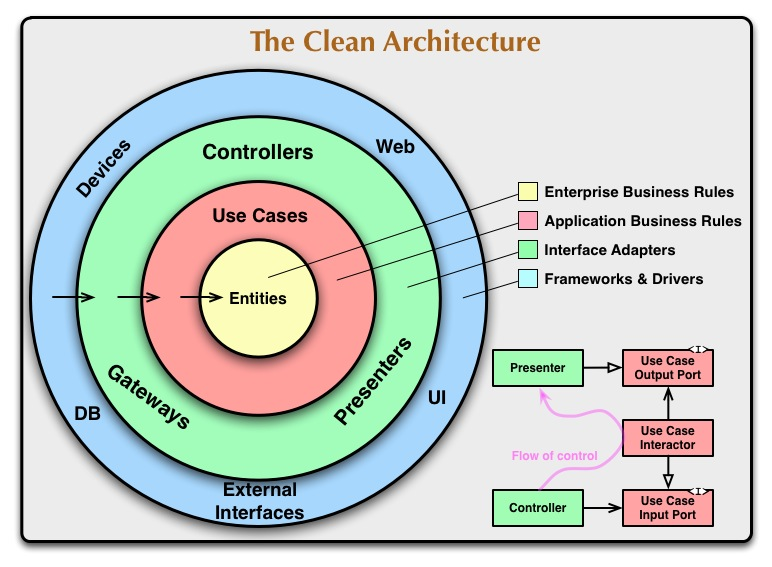

# Good code

## Introduction

There is not a single answer for the question _What is good code?_. There are many different opinions on what good code is. I will try to explain what I think good code is and how to achieve it in the context of web applications development.

Even if we narrow the scope, there are still many different opinions. Programming is not a science nor a religion. It is a craft about meaning and communication with machines. We can hardly measure the quality of the code with precision. The same goes for books: we can not really tell if the book is crap or excellent, it is very much a matter of taste, education and opinion rather than a fact.

The industry has not been really trying to answer this question properly. Short term speed is seen as a productivity factor, it is not. A few years ago I was asked to stop making unit tests because they were _slowing down the development_. Which is nuts, obviously. Velocity is usually told to be a metric for a _good_ team to improve, ignoring the fact that bad code usually lead the team to perform very poorly. I think velocity tends to create bad behaviors among developers but it might be useful at business level. The industry has come out with a bunch of tools to manage communication and time, but very little to ensure the quality of the code, maybe because it is very hard. So we have to deal with imperfection all the time, there is no way out. AI is going to deal with that.

## What is quality

When I listen what people think about quality it is clear that the level of abstraction does not meet the constant need for practical thinking in the development arena:

> "Quality is something that happens when the developers or the user experiences a software object. In software development, what is the event?: The next feature, the next release, the user, the system. Somehow if the quality of the event is good by some metrics, then the quality of the event is good."

> "Quality is something that is valuable to someone at some point in time".

The goal (the thing that is valuable so we try to measure it) should be shared (ideally) across the organization. Otherwise we can find quality expectations that are contrarian between teams. Quality in software can be influenced not only by the code itself but also by the infrastructure, the way we test, the way to operate as a company. The goals are shared but the expectations regarding quality are different depending on the role, each team has to bring their own metrics and wishes about the expectations towards the achievement of the company goals.

It is quite difficult to find metrics that shows improvements in quality given that it depends heavily on context, and context is a multi variable reality. We need to be concise in what is that we want and yet choose metrics that talk about the whole system, for instance:

-   Lead time.
-   Number of bugs.
-   How quickly can we test the whole application.

Some metrics that are not shared or useful to improve quality:

-   Velocity.
-   Lines of code.
-   Number of commits.
-   Test coverage.

As a developer I tend to focus on the code itself whatever the outcome is. Here are some expectations about the code that I think are important to improve the metrics above (and hopefully the quality of the code):

## Testable, readable, changeable

I would argue that most of the code must be easily testable, readable and changeable, here a few takes about this:

-   A test is the only proof that the code works. Code without tests is untrustworthy.
-   A unit test only asserts business rules. If the business rule does not change but a unit test breaks for whatever reason, then it probably is a bad test.
-   A good unit test is possible if the code is well decoupled. So it is key to have an architecture that allows to isolate the business code. Otherwise we have another kind of test.
-   Our business code must be framework-agnostic, database-agnostic, etc...
-   Code that has to be modified by many people over time must be highly readable vertically and horizontally.
    -   The names must be meaningful, consistent, precise and the semantics are shared by the team and across the codebase.
    -   Expressive arborescence of the project: if I deploy all the items of the tree I have to be able to know what the application does without opening a single file.
    -   Technical details are hidden behind abstractions. I do not care if it is MongoDb or Postgres behind the repository, I just want to operate an action on a domain entity.
-   Code must be easily changeable. The _S.O.L.I.D._ principles are a technique to achieve this. Not the only one.
-   Functions or methods are few lines of well defined, single responsibility code, and whenever possible they are idempotent (which are super easy to test), isolating side effects (like sending and email or modifying the state of the database).
-   Avoid abstractions unless you are sure that you need them. They tend to be a pain.
-   Pay more attention to data, sometimes is just easier to carry data around from inputs to outputs without adding behavior to it.
-   Decrease coupling (law of Demeter), increase cohesion.
-   Avoid inheritance, prefer composition.

## How

### Hexagonal architecture AKA Ports and adapters

Mostly achieved by implementing dependency inversion between these two:

-   The domain code (the thing that makes unique the application, that brings the money)
-   The infrastructure code (the frameworks, the libraries and the databases)

"Infrastructure" means, for the sake of this post, anything that is not domain code but it is still some kind of code.

_Dependency inversion_ means that the domain code does not depend on the infrastructure, on the contrary, the infrastructure depends on the domain code. I show an example below.

But generally speaking, as said by Robert C. Martin: "The Dependency Rule says that source code dependencies can only point inwards. Nothing in an inner circle can know anything at all about something in an outer circle. In particular, the name of something declared in an outer circle must not be mentioned by the code in the an inner circle. That includes, functions, classes. variables, or any other named software entity."

So it is clever to pay attention to the imports list at the very beginning of the file. If you see a dependency to a framework or a database and this is domain related code, you are doing it wrong.



"Clean architecture" by Robert C. Martin (see the image above) is not the same as "Hexagonal architecture" by Alistair Cockburn, but I think it is more or less the same objectives, as in the onion architecture.

### SOLID principles (SRP, OCP, LSP, IS, DI)

Again Robert C. Martin came out with this list of principles that are very useful to improve overall quality of our software.

#### SRP Single responsibility principle

**There is one reason to change a piece of code**. A piece of code can be represented by a function, a class, a module...

Or another way to see that: the piece of code should only do one thing. This is not about the number of lines of code, it is about the responsibility of the code taken in a more abstract level. Does it do what it says the name of the class? This is not enough. If we look at the internals of the class... How many reasons to change there are?

This is closely related to the concept of cohesion.

#### OCP Open to extension, close to modification

A class can modify its behavior at runtime if we inject interfaces, not implementations.

Or put in other words: We can change the behavior according to the implementation that is chosen in runtime. This way we can extend or modify the behavior of the code without modifying it directly, we just create a new implementation. This is very useful for testing, for example. We can inject a mock/spy implementation of a piece of code (like a repository) to test the business code. If you have to learn a useful design pattern, learn strategy pattern.

#### LSP Liskov substitution principle

This one I find it less useful because I just **avoid inheritance as much as possible**.

But the idea is that an instance of a child class should be replaceable by its parent class without breaking the code. The internal behavior may change obviously but the code must work. This is known as type-subtype correctness.

#### IS Interface segregation

This one is super useful. A class should not be forced to implement methods that are not needed.

In my experience you can achieve that by having in mind that you should **design your interfaces for the client** and not for the implementation. TDD (Test driven development) can help a lot here because you will only write the code that is needed.

#### DI Dependency inversion

Domain code should not depend on external modules or libraries. Our domain defines the way external modules must behave if the want to talk to us. This is how we inverse the dependency. Let's see an example using an object called `Folder`, imagine it is important in our domain.

Here we define _the interface_ (the port in terms of Hexagonal architecture) that the infrastructure layer must implement (the implementation is the adapter) if they have to communicate:

```typescript
import { Folder } from './Folder'

export interface FolderRepository {
    save(folder: Folder): Promise<void>
}
```

Then the infrastructure layer will implement this interface like this one for using TypeOrm:

```typescript
// ... imports
import { EntitySchema } from 'typeorm'

export class TypeOrmFolderRepository
    extends TypeOrmRepository<Folder>
    implements FolderRepository
{
    public async save(folder: Folder): Promise<void> {
        return this.persist(folder)
    }

    protected entitySchema(): EntitySchema<Folder> {
        return FolderEntity
    }
}
```

And then we can inject this implementation in our domain. This is the use case that creates a folder (the client for which we have designed the interface):

```typescript
export class FolderCreator {
    constructor(
        private readonly repository: FolderRepository,
        private readonly eventBus: EventBus
    ) {}

    async run(request: FolderCreatorRequest): Promise<void> {
        const folder = Folder.create(
            new FolderId(request.id),
            new FolderName(request.name)
        )
        await this.repository.save(folder)
        await this.eventBus.publish(folder.pullDomainEvents())
    }
}
```

As you see in this example, the `FolderRepository` is injected via the constructor, it is an interface so we can use whatever implementation we want in runtime without being coupled to concrete implementations.

This use case _FolderCreator_ is super easy to test because has no dependencies on external modules.

### Coupling and cohesion

Cohesion: all the things that change together remain together.  
Coupling: if two things should not change together then they should not be together.

You need to think about those at every level of software architecture and find the right amount of cohesion and coupling. Some coupling can be fine inside one module between two pieces of the domain code closely related. On the other side coupling with external modules of libraries is an issue. Too much cohesion in a class could mean that your class is actually violating SRP. So the tricky part is to find the right amount of those. It is absolutely necessary to find the right semantics to get the right balance.

### Testing: UT, e2e

Check out this post I wrote specifically on testing: [Testing](2020-02-21-testing.md)

### Code review

Check out this post I wrote on code reviews: [Code review](2019-03-25-code-review.md)

### Static analysis tools / code standards

Static analysis tools are great to keep a consistent level of quality but I do not think they are going to make us write better code. They are just a tool to help us to keep the code clean and consistent.

We need to **automate** anything that we can automate on this topic, at least the **linting** and the **formatting** of the code, using whatever code style by default as long as it is consistent and becomes a team convention.

A **.editorConfig** file can help as well to keep rules consistent across the team.

Static analysis tools like **SonarQube** can help giving insights about the quality of the code.

### Security

I am not an expert on the topic but there are a few things to consider for starters. Good code have to care about security as well:

-   Pay attention to [OWASP 10](https://owasp.org/www-project-top-ten/).
-   Work with modern technologies and well supported libraries and frameworks.
-   Update your dependencies regularly. Take the time to update to major versions, do not let your code die.
-   Automate security updates.
-   Be aware of the news of our ecosystem.
-   Let external experts audit your applications.
-   Do not trust user input.
-   Strong and well-tested authentication and authorization system.
-   Know the basics of networking.

### Performance

Generally speaking I do not consider that the gain of milliseconds is worth the effort most of the time regarding quality in the context of web applications. So I would go with the more expressive, readable and testable code possible. The famous quote by Kent Beck is a good way to see it:

> "Make it work, make it right, make it fast"

Some **time complexity and space complexity analysis** with O notation can lead to discover interesting things and make your code much faster. But I would not consider for example to reduce indirections in my code (like putting everything in one file or not creating interfaces etc...). Readability and testability are much more important at the end of the day, at least until AI could really write complex applications for us and lead with imperfections and bad code in a matter of minutes.

### Data

Some knowledge of data structures will not hurt.

I tend to find the mix of data and behavior usually done in OOP less and less useful and prone to errors.

Classes are useful to define invariants, but we may not need them to represent data at all. I think that mixin data and behavior should not be the default but the exception.

### Domain driven design

DDD is a body of knowledge that started with the book of Eric Evans, focus on modeling systems using the language of the domain (the so-called ubiquitous language).

The design of the system is driven by the domain and not by the technical details. It is a very interesting approach to design software but it does not guarantee (sadly) good code.

If the product/domain is complex, it could be a good idea to use this approach. If the product/domain is simple, it is probably an overkill.

DDD has two aspects, the strategic and the tactic. Sometimes it might be useful to think in DDD terms at business level (strategic) without implementing every pattern in our code base (tactic). We do not want premature optimization but we want to know the domain and create this shared language.

-   The strategy: A method for problem exploration.

-   The tactic: How to design the code itself:
    -   Data:
        -   Value objects.
        -   Entities.
        -   Aggregates.
        -   Repositories.
        -   Factories.
    -   Behavior:
        -   Application services.
        -   Domain services.
        -   Infrastructure services.

We need to calibrate the both of them depending on the context of our application to avoid overuse. The tactical part is quite prescriptive so take it with a grain of salt.

Hexagonal architecture fits very well with DDD because of this protection of the domain code from the infrastructure.

**Event storming** seems useful to explore the domain. It is a workshop that involves all the stakeholders of the project. It is a very good way to start a project. But it should not automatically translate into code design. You still need to think about the code design, but you already have a good idea of the domain and the semantics.

I think most of the time DDD is overkill for the majority of CRUDish applications.

Also I think it is a very OOP oriented approach with this mix of data and behavior that I do not find very useful sometimes. It is also very entity/aggregate centric creating kind of an untouchable ivory tower representing the domain. Some people think it may be challenging in distributed systems.

I would rather start with the verbs (the actions the external world want to perform on the system) and be careful to not fall into the rabbit hole of very prescriptive solutions.

## Links

I have created this repo [Architecture example](../projects/architecture-ts-ddd/README.md). A try of creating an architecture example for a web application in typescript inspired somehow by the tactical part of domain driven design and clean architecture.

Other posts that I have written about this topic:

-   [Simplicity in code](2022-11-10-simplicity-in-code.md)
-   [Ports and Adapters](2016-06-06-ports-and-adapters.md)
-   [Testing](2020-02-21-testing.md)
-   [Code review](2019-03-25-code-review.md)

## Books

A few books that I think are very useful to understand what good code is:

-   [Clean code](https://www.amazon.com/Clean-Code-Handbook-Software-Craftsmanship/dp/0132350882)
-   [Clean architecture](https://www.amazon.com/Clean-Architecture-Craftsmans-Software-Structure/dp/0134494164)
-   [Domain driven design](https://www.amazon.com/Domain-Driven-Design-Tackling-Complexity-Software/dp/0321125215)
-   [Grokking Simplicity](https://www.manning.com/books/grokking-simplicity)

The last one is much less known but I think that if you are an OOP developer you also need to be familiar with functional programming. This is a gentle introduction with javascript.

## Conclusion

-   I think quality starts at the unit test level. If we can test easily a use case and the business rules, we are in a good path.
-   To be able to have easy-to-test use cases, we need to implement some design pattern at the architectural level like "Clean architecture".
-   To have a code that is expressive, with good names and easy to read, we need to explore the domain with the stakeholders and use their language throughout the codebase.
-   We must hide technical details behind abstractions: the code has to be agnostic regarding frameworks, databases or any library.
-   The SOLID principles are a good way to keep your code clean.
-   Functional programming can help to write better code in any paradigm, like OOP (better functions, less coupling data-behavior, isolate side effects, testing, data as first class citizen).
-   Code should have low coupling (law of Demeter) and high cohesion.
-   Choose whatever code style and automate linting and formatting.
-   Team convention works better than personal preferences.
-   Company goals and metrics are shared, quality expectations belong to each team.
